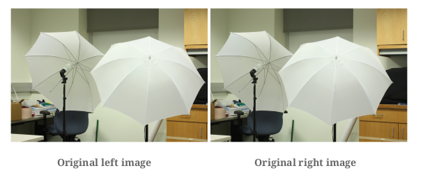
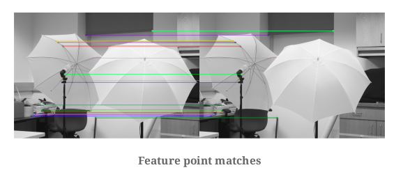
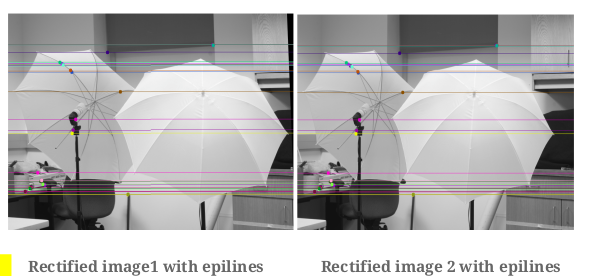
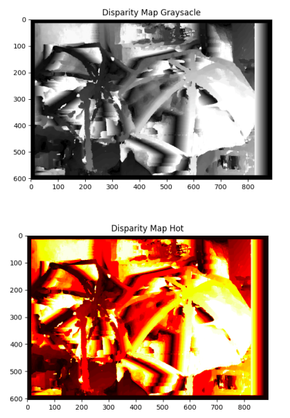
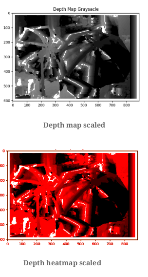

# Depth-estimation-using-stereovision
In this project, we are going to implement the concept of Stereo Vision. We
test the code on 3 different datasets, each of them contains 2 images of the same
scenario but taken from two different camera angles. By comparing the
information about a scene from 2 vantage points, we can obtain the 3D
information by examining the relative positions of objects. For detailed explanation checkout [this link](https://github.com/savnani5/Depth-estimation-using-stereovision/blob/main/ENPM673-%20PROJ3.pdf).

---
## Pipeline

### Calibration


1) Feature Detection And Matching

    a) Here we create an ORB feature detector, to generate max keypoints(10000) find
    keypoints and descriptors in the given image. The SIFT feature detector is not
    used because it can be patented in future and they may break the code.

    b) Then, we use a Brute Force/ FLANN based matcher to find the best matches in
    the keypoints between 2 input images based on hamming distance.

    c) Finally, the matches are sorted based on distance and 30 best matches are
    selected from the total matches.

    d) To fill the final list of feature points, points are extracted from the matches and
    the matches are plotted simultaneously on both images to visualize them.



2) Calculating Fundamental matric using **RANSAC**

    a) Here we calculate the Fundamental matrix using the least squares method. We
    have 8 equations and we input exactly 8 points to form the A matrix from them.

    b) Here, the RANSAC algorithm is applied to choose the best F matrix. 8 random points
    are sampled and fed into the calculate_F_matrix function iteratively and we calculate
    the error in estimating the points. Comparing this with a predefined threshold, we can
    classify the inlier points and choose the Best F matrix based on the max_inliers criteria.

3) Calculate the Essesntial Matrix
    Here, the Essential matrix is calculated using the Fundamental matrix and the intrinsic
    camera parameters.

4) Camera Pose Estimation

    a) The *extract_camera_pose* function is used to extract the 4 camera pose solutions form the E matrix by
    calculating the svd of the E matrix as U Σ VT:

    b) The *disambiguate_camerapose* function is used to shortlist the best camera pose based on the triangulation check
    for the chirelity condition.

### Rectification
Here we warp the images to make the epipolar lines horizontal (epipoles at infinity),
so that disparity calculation is restricted to one dimension only. Essence of this step is
to make the camera setups parallel after homography transformation.



### Correspondance

For each pixel in the image we calculate disparity map using a sliding window and
sum of squared differences approach and save the grayscale and heatmap images. We can also use the sum of absolute difference approach.



### Depth Map
Using the disparity map from previous step compute the depth information
for each pixel using the below formula:

    depth = (baseline*f)/disparity



---
## Input
[Input Data](https://drive.google.com/drive/folders/1WQ_XcDhuWhyYxVmP2qT-3SggmiC00LQa?usp=sharing)

## Output
[Output Data](https://drive.google.com/drive/folders/1D70GsEdZhFj3jked1Vh-x61ILViSFlOp?usp=sharing)

---
## How to Run the Code
1) Change the dataset directory in *main.py* file:

    ```PY
    img1 = cv2.imread(f"Dataset{number}/im0.png", 0)
    ```

    ```PY
    img2 = cv2.imread(f"Dataset{number}/im1.png", 0)
    ```
2) Run the following command:
  
    ```sh
    python main.py
    ```
---
## References
1) https://docs.opencv.org/master/dc/dc3/tutorial_py_matcher.html
2) https://cmsc733.github.io/2019/proj/p3/#estE
3) https://www.cc.gatech.edu/classes/AY2016/cs4476_fall/results/proj3/html/sdai30/index.html
4) https://stackoverflow.com/questions/30716610/how-to-get-pixel-coordinates-from-feature-matching-in-opencv-python
5) https://stackoverflow.com/questions/27856965/stereo-disparity-map-generation
6) https://stackoverflow.com/questions/36172913/opencv-depth-map-from-uncalibrated-stereo-system
7) https://www.cc.gatech.edu/classes/AY2016/cs4476_fall/results/proj3/html/sdai30/index.html
8) https://pramod-atre.medium.com/disparity-map-computation-in-python-and-c-c8113c63d701
9) https://stackoverflow.com/questions/46689428/convert-np-array-of-type-float64-to-type-uint8-scaling-values/46689933
10) https://stackoverflow.com/questions/59478962/how-to-convert-a-grayscale-image-to-heatmap-image-with-python-opencv
11) https://www.youtube.com/watch?v=KOSS24P3_fY
